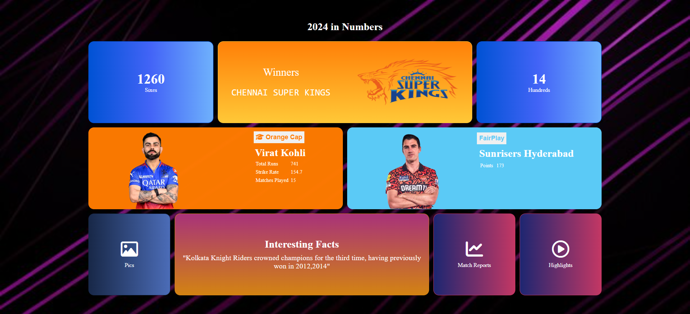

# 🏏 IPL Dashboard - Responsive Web App

## 🌟 Overview
Welcome to the **IPL Dashboard**, a responsive and dynamic web application that presents insightful data visualizations for the Indian Premier League (IPL). This project is designed to deliver an interactive experience for cricket enthusiasts, allowing them to explore team performances, player statistics, and match outcomes.

## 🎨 Features
- **Fully Responsive** 📱💻 - Optimized for all screen sizes using **CSS media queries**.
- **Live Score & Stats** 📊 - Displays IPL team rankings, top players, and match stats.
- **Dynamic Visualizations** 📈 - Enhanced user experience with interactive charts and tables.
- **Dark & Light Mode** 🌙☀️ - Toggle between themes for a personalized experience.
- **Modern UI Design** 🎨 - Clean, intuitive, and engaging interface.

## 🛠️ Technologies Used
- **HTML5** - For structuring the content.
- **CSS3** - Styled using **Flexbox & Grid** for responsiveness.
- **JavaScript** - For interactivity and data handling.
- **Chart.js** - To visualize IPL statistics with stunning charts.

## 🚀 Installation & Usage
1. Clone the repository:
   git clone https://github.com/ManvithaPola/IPL.git
2. Open `index.html` in your favorite browser.

## Screenshots

